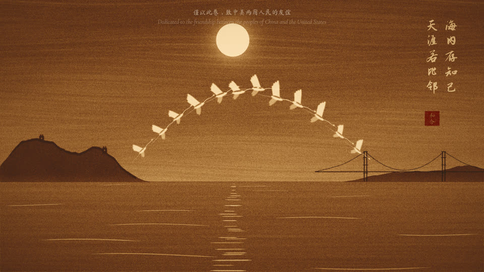
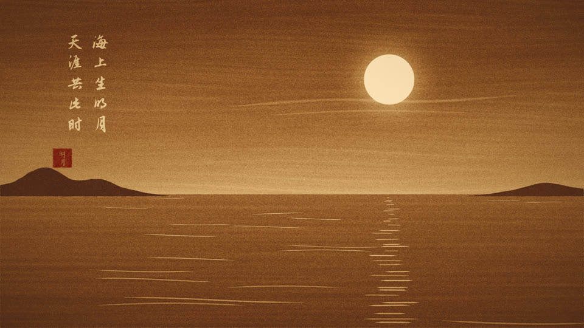
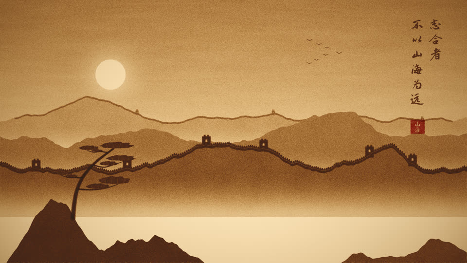
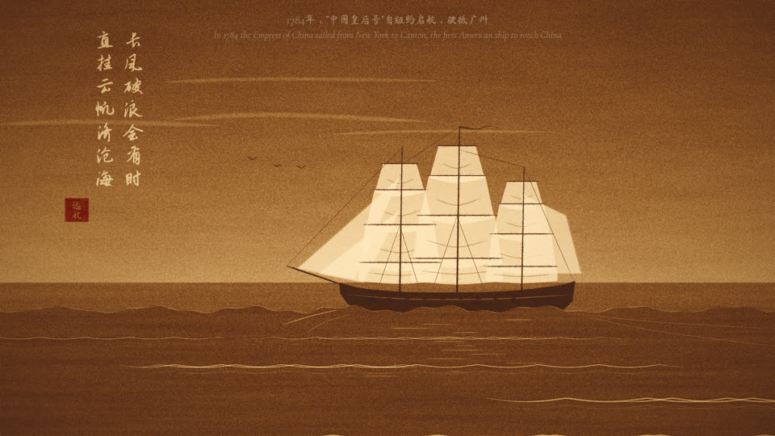
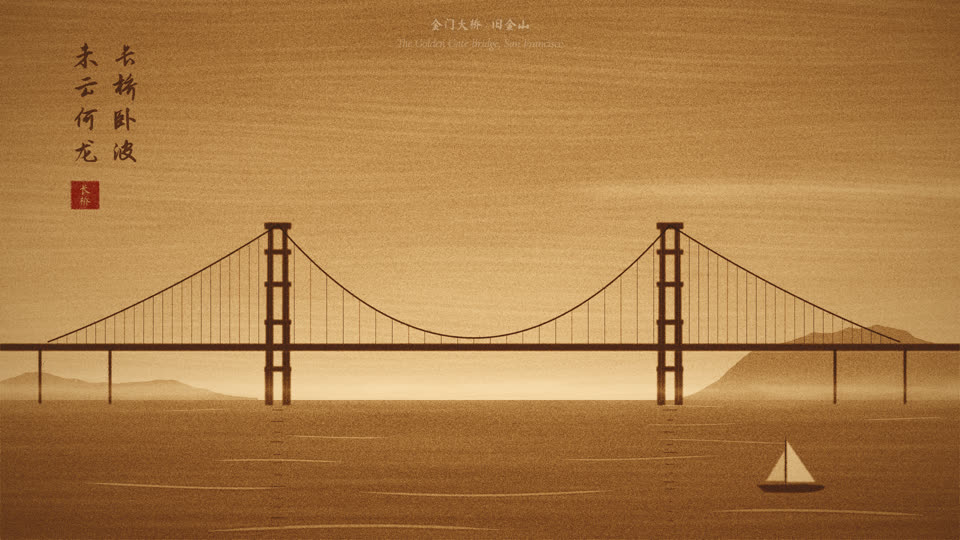
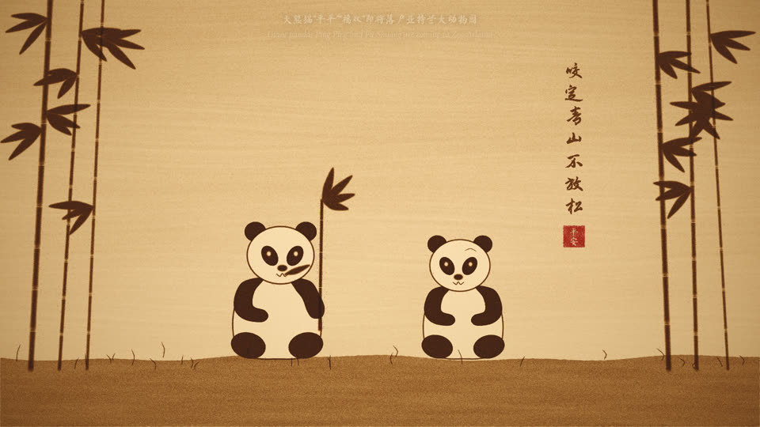
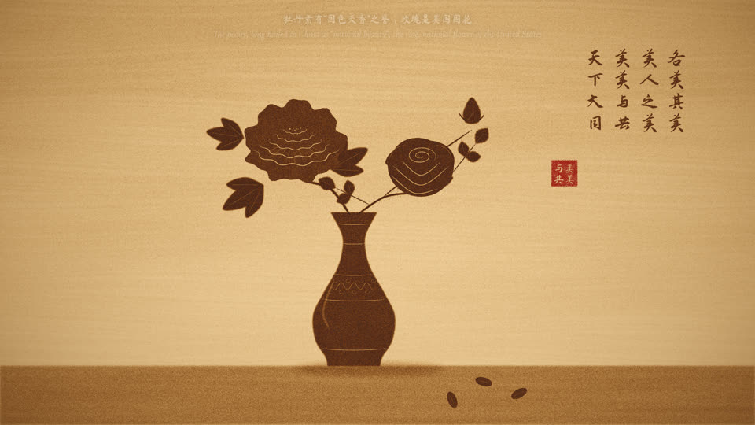
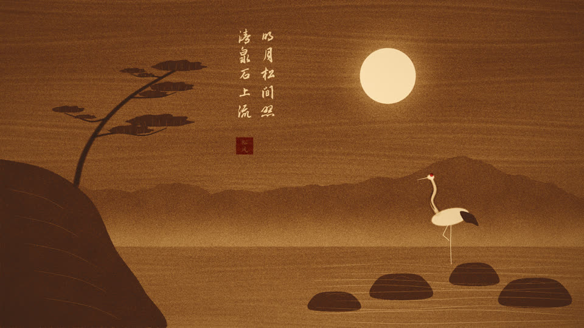
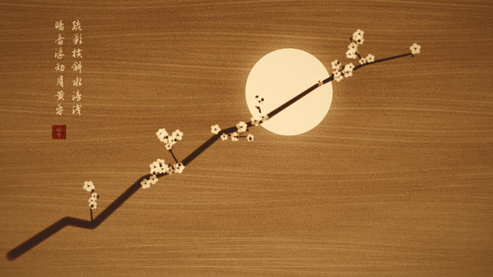
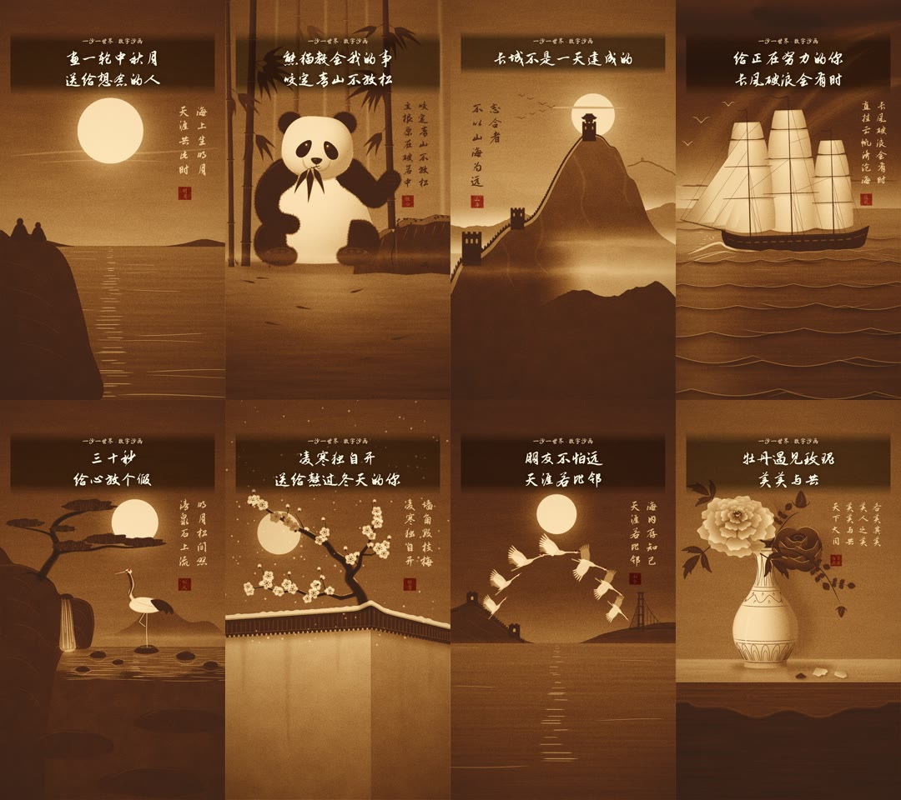

# 沙卷 SandScroll · 《山海不为远》

24 小时不间断的 YouTube 直播：在「光台」上实时绘制中国风沙画，配以程序实时创作的古筝、洞箫与古琴音乐。
首档节目《山海不为远》以 **2026 年 9 月 23–25 日习近平主席对美国进行国事访问**为契机，用明月、长城、1784 年“中国皇后号”、金门大桥、大熊猫“平平”“福双”、玫瑰与牡丹、鹤桥等意象，讲述两国人民跨越山海的友谊；常青节目（松鹤、梅、江雪、竹里馆）保证热点之后频道仍有长期价值。



| | | |
|---|---|---|
|  |  |  |
| 海上生明月 | 长城 · 志合者不以山海为远 | 远航 · 一七八四 |
|  |  |  |
| 长桥卧波 | 熊猫“平平”“福双” | 美美与共 |
|  |  |  |
| 松鹤 | 梅 | 江雪 |

## 亮点

- **像真正的沙画一样被“画”出来**：密度场模拟沙层，比尔–朗伯定律模拟光台透光（薄沙发琥珀光、厚沙近墨色），掌心铺沙、指尖勾光、握沙成线，画与画之间以掌扫转场，并留下淡淡“残影”。
- **艺术家的手**：一只写实的右手在光台上作画，食指勾线、握拳漏沙、手掌抹沙；手指边缘透出光台的光，快速移动时有运动模糊；停笔时手移出画面，封面和结尾定格画面保持干净。直播默认用较省算力的画质（`--hand low|high|off`，或环境变量 `SANDSCROLL_HAND`），网页播放器可用 `?hand=high`。
- **诗·书·画·印**：每幅画完成后以毛笔字体在沙中题诗（竖排、逐字书写），再钤朱文印章，最后浮现中英双语题签。
- **音乐 100% 原创、永不重复**：五声调式（宫商角徵羽）+「起承转合」乐句结构，Karplus–Strong 物理建模的古筝（按音、滑音、刮奏、摇指）、古琴（走手音、泛音）与洞箫（气声、颤音），配以大厅混响；无任何录音素材，没有 Content ID 版权风险。
- **可复现**：同一种子得到完全相同的演出，且成画与帧率无关（测试覆盖）；默认每天更换种子，每天的演出都不一样。
- **7×24 稳定运行**：Node 实时渲染 → ffmpeg（H.264 + AAC）→ YouTube RTMPS；断线指数退避自动重连；Docker 健康检查 + 自动重启。在 4 核机器上 1080p30 渲染 + 编码速度约为实时的 2.3 倍。

## 快速开始

需要 Node.js ≥ 20 与 ffmpeg。

```bash
cd sandscroll
npm install
npm run setup            # 下载 OFL 开源字体到 assets/fonts/

npm run build:web        # 生成 dist/sandscroll.html，浏览器直接打开即可预览（点击按钮开启音乐）
npm run render -- --duration 60s   # 渲染 1 分钟带音乐的 1080p 样片 preview.mp4
npm run snapshot -- --scene pandas # 导出某幅画的过程截图到 snapshots/
npm test                 # 引擎与音乐测试
```

### 正式开播（服务器）

```bash
cp deploy/.env.example deploy/.env   # 填入 YouTube 串流密钥
docker compose up -d --build
docker compose logs -f               # 每分钟一行 t=… speed=1.00x
```

频道注册、直播设置、标题描述、合规与日常运营见 **[docs/运营手册.md](docs/运营手册.md)**。

### OBS 方案（不想用服务器时）

在 OBS 中添加「浏览器」来源，指向 `dist/sandscroll.html?ui=0&autoplay=1&hd=1`，勾选「通过 OBS 控制音频」，即可用 OBS 推流。

## 竖屏短视频：「一沙一世界」

同一套引擎也能输出 9:16 竖屏短视频，用于 TikTok、小红书、抖音和 YouTube Shorts。每集约 45 秒：开头 1 秒是钩子标题，接着沙画快速成形、题诗、钤印，最后是双语诗句和一句互动提问。首批 8 集，每集一个正能量主题（团圆、坚持、奋斗、松弛、坚韧、友谊、包容）。



```bash
node tools/make-shorts.mjs --out shorts        # 全部 8 集：MP4 + 9:16 / 3:4 封面 + 双平台文案
node tools/make-shorts.mjs --only moon --preview --snap 4   # 低清预览 + 截图
```

竖屏场景在 `src/shorts/scenes/`（虚拟画布 1080×1920），文案在 `src/shorts/copy.js`，运营方法见 **[docs/短视频运营手册.md](docs/短视频运营手册.md)**。

### 第二批：沙画变身 · Sand Twist（TikTok 循环短片）

每条约 19 秒：第 1 帧就在深色沙面上疾划出一道亮线，同时出现英文钩子标题；约 5 秒画出第一幅画，接着手掌一抹变成另一幅，题字、钤印后，再一掌扫回开场画面，TikTok 重播时首尾无缝衔接。导演在 `src/core/reel.js`，场景在 `src/reels/`。

```bash
node tools/make-reels.mjs --out reels        # 6 条 MP4 + reels.json（封面秒数、英文文案、话题标签）
```

## 配置

| 位置 | 作用 |
|---|---|
| `program.json` | 节目顺序、每幅画停留时长、时事字幕（notes，可新增、替换，或设为 `null` 隐藏） |
| `deploy/.env` | 串流密钥、分辨率、帧率、码率、x264 预设、随机种子 |
| 命令行 | `node src/node/stream.mjs --help` 同名参数：`--out`、`--rtmp`、`--duration`、`--program`、`--seed`、`--width` … |

## 目录结构

```
sandscroll/
├── src/core/        渲染引擎：沙层 field、光台 light、动作 actions、蒙版 mask、题诗 text、印章与题签 overlay、导演 show
├── src/scenes/      12 幅横屏场景（每个文件一幅画：构图、动作序列、题诗、印章、配乐情绪）
├── src/shorts/      竖屏短视频系列「一沙一世界」：场景、文案
├── src/reels/       TikTok 循环短片「沙画变身」：场景、文案
├── src/music/       音乐引擎：乐器建模、混响、五声调式作曲
├── src/node/        推流程序 stream.mjs、Node 画布与字体、配置读取
├── src/web/         浏览器播放器（预览 / OBS 浏览器来源）
├── tools/           短视频生成、截图、网页打包、音乐演示、健康检查、字体下载
├── deploy/          环境变量模板
├── docs/            直播运营手册、短视频运营手册、截图
└── tests/           node:test 测试
```

## 新增一幅画

在 `src/scenes/` 新建文件，导出一个场景对象，并在 `src/scenes/index.js` 注册：

```js
import * as K from '../core/kit.js';
import * as L from '../core/landscape.js';

export default {
  id: 'lotus',
  music: 'garden',                 // 配乐情绪（见 src/music/presets.js）
  opening: 0.3,                    // 转场后沙层的基础厚度
  title: { cn: '荷', en: 'Lotus' },
  poem: { columns: ['接天莲叶无穷碧'], cn: '接天莲叶无穷碧', en: '…', by: '宋 · 杨万里 · Yang Wanli, Song dynasty' },
  seal: '清涟',
  build(stage, rng) {
    return [
      ...K.cover(stage, stage.vgrad(0.4, 0.15, 0, 1080)),         // 掌心铺沙
      K.reveal((st) => st.mask(polygon), { op: 'set', level: 2 }), // 填出形状
      K.carve(path, { width: 4 }),                                  // 指尖勾光
      K.pour(path, { width: 6 }),                                   // 握沙成线
      K.inscribe(stage, { columns: this.poem.columns, x: 1700, y: 100 }),
      ...K.seal(stage, this.seal, 1640, 520),
    ];
  },
};
```

坐标统一使用 1920×1080 虚拟画布，引擎会按实际分辨率缩放。

## 许可与致谢

- 字体：Zhi Mang Xing、Ma Shan Zheng、Cormorant Garamond，均为 SIL Open Font License（运行 `npm run setup` 下载）。
- 诗词均为公有领域古籍；「各美其美，美人之美，美美与共，天下大同」引自费孝通并署名。
- 音乐由本项目算法实时生成，不含任何第三方录音或编曲。
